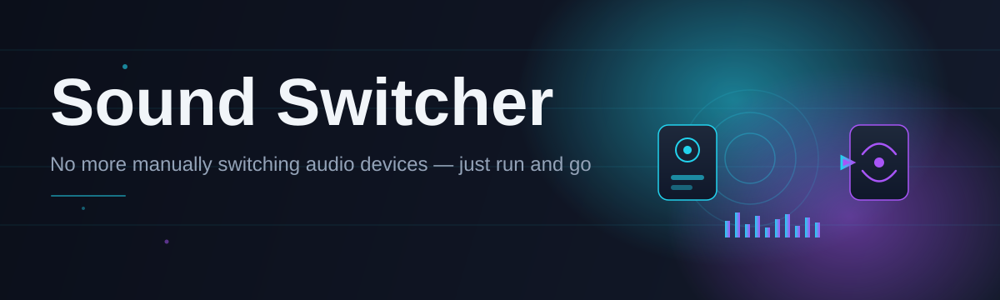

# sound-switcher-controller 🔊⚡

  

*Swap your audio output faster than you can say "wrong speakers again" — one hotkey, zero menus.*

  

## 🎯 Overview

It started with a pair of headphones, a Bluetooth speaker, a monitor with built-in audio, and a Windows sound menu that made me click four times every single time I wanted to switch between them. That got old fast. So one weekend I sat down and built **sound-switcher-controller** — a tiny, no-nonsense tray app that lets you cycle or jump straight to any audio output device without ever touching the Windows Sound Settings panel again.

This isn't some bloated audio suite with equalizers, streaming integrations, and a subscription tier hiding behind a "Pro" badge. It's a **sound switcher** in the purest sense of the phrase — it does one job, and it does it instantly. Under the hood it talks directly to the Windows Core Audio APIs, enumerates your active playback devices, and flips the default output (and default communication device, if you want) with a single keystroke or tray click.

Who's it for? Gamers who juggle headset and speakers mid-match, streamers switching between monitor audio and a mixer input, remote workers bouncing between a webcam mic and a USB headset all day, and honestly anyone who has ever muttered "why is this so many clicks" while reaching for the volume icon. If that's you, you're home.

---

## 🧩 What It Actually Does

> [!NOTE]
> Every capability below runs locally against the Windows audio stack. Nothing phones home, nothing needs an account.

- **Instant device cycling** — bind a single hotkey to rotate through every enabled playback device in the order you define, so your keyboard becomes the remote for your whole audio setup.

- **Direct-jump hotkeys** — assign a dedicated shortcut to a specific device (say, `Ctrl+Alt+1` for headphones) so you skip the cycle entirely and land exactly where you want.

- **Tray-first design** — the app lives quietly in your system tray with a live icon reflecting the current output, and a right-click menu that lists every device with one-click switching.

- **Independent communication device routing** — set your default playback and your default "communications" device (the one Discord/Teams/Zoom actually use) separately, because Windows treats them differently and most tools ignore that.

- **Auto-switch on device connect** — plug in your headset or dock and the controller can automatically promote it to default, no manual step required.

- **Volume-safe switching** — device switches preserve independent per-device volume levels, so your speakers don't blast at max because your headphones were quiet.

- **On-screen notifications** — a lightweight toast confirms which device is now active, so you're never guessing whether the switch actually landed.

- **Portable, no-install mode** — run it straight off a USB stick or a synced folder; it writes its config next to the executable, not scattered across your registry.

---

## 🚀 Getting Started

1. Head to the project landing page using the download button above.

2. Grab the latest build — no installer wizard, no bundled toolbar offers, just the app.

3. Run the executable. It drops into your system tray and quietly waits.

4. Right-click the tray icon to see your devices, or open Settings to bind hotkeys the way you actually think.

> [!TIP]
> Pin the tray icon so it's always visible — Windows loves hiding icons in the overflow tray, and you'll want this one front and center.

---

## 🖥️ System Requirements

| Requirement | Details |
|---|---|
| OS | Windows 10 (64-bit) or Windows 11 |
| Dependencies | None — fully standalone executable |
| Disk space | Under 15 MB |
| Admin rights | Not required for normal use |
| .NET runtime | Bundled, nothing extra to fetch |

> [!IMPORTANT]
> This is a Windows-only sound switcher. It relies on the Windows Core Audio APIs directly, so there's no macOS or Linux build — and there won't be, since the whole architecture is built around Windows' audio session model.

---

## ⚙️ How It Works

The design is deliberately simple — a small pipeline rather than a sprawling service:

1. **Enumeration** — on launch, the controller queries the Windows audio endpoint enumerator for every active render device.

2. **Registration** — each device gets mapped to an internal index and, if configured, a hotkey binding.

3. **Listening** — a lightweight global hook waits for your assigned shortcuts or tray clicks.

4. **Switching** — on trigger, it calls into the Core Audio policy config to set the new default device (and communications device, if separated).

5. **Confirmation** — a toast notification and updated tray icon confirm the switch landed successfully.

---

## 🛟 Troubleshooting

<strong>My hotkey isn't switching anything — what gives?</strong>

Check for a conflict with another app's global hotkey. Discord, OBS, and Nvidia overlays are frequent offenders. Rebind to an unused combo in Settings.

<strong>A device I unplugged still shows in the list.</strong>

Windows sometimes keeps disconnected devices registered until you disable them manually. Toggle "Hide disabled devices" in the app's settings to filter these out automatically.

<strong>The tray icon disappeared after a Windows update.</strong>

This is a known Windows tray-refresh quirk, not an app bug. Relaunch the executable and it re-registers instantly.

<strong>Communications device didn't switch along with playback.</strong>

That's intentional if you've set them independently. Enable "Link playback and communications" in Settings if you want them tied together.

<strong>Does this work with virtual audio devices or mixers?</strong>

Yes — anything that registers as a standard Windows audio endpoint (virtual cables, mixer software outputs) shows up and switches like any physical device.

---

## 🎨 UI / UX Details

- **Keyboard-first**: every core action — cycle, jump, mute toggle — has a customizable global shortcut.

- **Themes**: light, dark, and an auto mode that follows your Windows theme setting.

- **Tray menu ordering**: drag-reorder devices in Settings to match how you think about them, not how Windows lists them.

- **Minimal footprint**: no persistent background window, no taskbar clutter — tray-only by design.

- **Notification style**: choose between toast, subtle overlay, or silent mode if you'd rather just trust the icon.

> [!WARNING]
> Running multiple instances simultaneously can cause hotkey binding conflicts. Stick to one instance — the tray icon will let you know if one's already running.

---

## 🤝 Contributing & Community

This started as a solo weekend build, and it's grown because people kept opening issues with genuinely good ideas. Pull requests, bug reports, and feature suggestions are all welcome — especially around device-detection edge cases, since Windows audio hardware is a wonderfully inconsistent landscape.

- Open an issue if something's broken or missing.

- Fork it, tinker, send a PR — clean, focused changes get reviewed fast.

- Star the repo if it saved you a few daily clicks — it genuinely helps visibility.

 

---

## 📜 License

Released under the [MIT License](LICENSE), 2026. Use it, fork it, ship your own spin on it — just keep the license notice intact.

---

## ⚖️ Disclaimer

This project interacts with Windows audio device settings at the system level. While it's built to be safe and reversible, always keep in mind you're changing default playback routing — double-check your device list after major Windows updates, and use at your own discretion.

